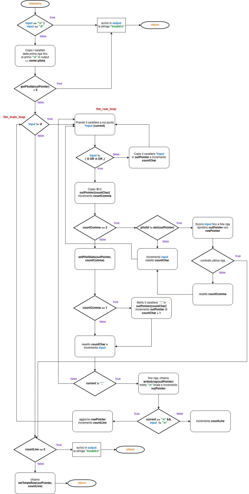

\newpage

# Flusso
`telemetry` rappresenta la funzione principale, che determina il flusso di esecuzione di tutte le altre funzioni di appoggio. \newline
Come prima cosa viene controllato se la stringa **input** è vuota o uguale a `\n`, ed in caso terminata l'esecuzione come invalida.
Altrimenti, viene copiata la prima riga, fino a `\n`, in **output** e considerata come nome del pilota. Tramite la funzione **getPilotId** viene estrapolato dal nome l'id del pilota e ritornato. Se il valore di ritorno è minore di `0`, l'esecuzione termina come invalida.
La funzione, per leggere le righe ed i campi, si compone di due cicli principali. `tlm_main_loop`, `tlm_row_loop`. Il primo scorre le righe del file carattere per carattere fino a che non trova il carattere di fine stringa `\0`, il secondo scorre la riga corrente, carattere per carattere.
Ogni carattere che leggo viene salvato, tramite **outPointer**, in **output**. \newline
Quando viene letto un carattere di tipo `,`, `\n`, `\0`, significa che o è terminata la lettura di un campo, o che è terminata la riga corrente. Viene quindi scritto in posizione **countChar** il carattere di fine stringa `\0`, in modo da avere disponibile in **outPointer** il valore del campo.
Tramite **countComma** vengono stabilite le azioni da fare.

| **Valore**     | **Azione**                                                    |
| :-----------------: | ------------------------------------------------------------------ |
|     **1**         |   viene messa la virgola in posizione `outPointer + countChar` e incrementato **outPointer** in modo da essere in posizione giusta per scrivere il campo successivo.|
|                   |
|     **2**         |   viene controllato se **idPilot** corrisponde all'id presente nella riga, e scritto in **output**. Se non corrispondono viene saltata la riga e azzerato **countComma** e se si tratta anche dell'ultima l'esecuzione salta alla fine dei due cicli. Altrimenti, se la riga è valida, viene incrementato **input** e riparte il ciclo `tlm_row_loop`|

Per ogni campo viene inoltre chiamata **setPilotStats**, incrementato **input** e resettato **countChar**.
Se il carattere speciale è `(\n o \0)`, viene chiamata **writeArray**, inserito il carattere `\n`, e se si tratta dell'ultima riga, l'esecuzione salta a fine ciclo, altrimenti riparte da `tlm_main_loop`. \newline
Terminata la lettura, se **countLine** è uguale a `0`, l'esecuzione termina come invalida, altrimenti viene chiamata **setTotalsRow**, per i totali di fine file e terminata l'esecuzione.
\newline 
\newline
Di seguito la descrizione delle variabili **locali**  della funzione telemetry, ed il diagramma di flusso.

| **Variabile**     | **Descrizione**                                                    |
| ----------------- | ------------------------------------------------------------------ |
| **countChar**         |  **long**, inizializzato a `0`, memorizzata nel registro `ecx` conta i caratteri che vengono scritti dall'**input** all'**output**|
|                           |
| **countLine**             | **long**, inizializzato a `0`, contatore righe valide, ossia con id pilota valido|
|                           |
| **countComma**               | **long**, contatore che identifica il campo del file in cui si sta operando|
|                           |
| **rowPointer**            | **long**, puntatore di riga, punta sempre al primo carattere della riga, in **output**, che si sta scrivendo|
|                           |
| **outPointer**            | **long**, puntatore, inizializzato con il valore di **output** viene usato per scrivere nello spazio di memoria di **output**. Grazie a questo puntatore posso scrivere in **output** una qualsiasi stringa, mettere uno `\0` in posizione `outPointer + countChar` ed avere così la stringa valida|
|                           |
| **pilotId**               | **long**, id del pilota ottenuto dal file|

